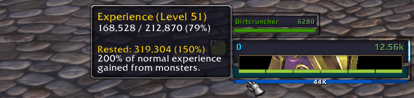

# oUF Progress

## Description

oUF Progress is an element for the unitframe framework [oUF](https://github.com/oUF-wow/oUF)
inspired by the progress bars of [Dominos](https://github.com/tullamods/Dominos/tree/master/Dominos_Progress).
It requires an oUF layout that supports it.



## Features

- five different display modes that you can switch between with a left mouse click
  - artifact
  - azerite
  - experience
  - honor
  - reputation
- `OnMouseUp` handlers per mode (left click is reserved for mode switching)
  - artifact toggles the Artifact UI
  - azerite toggles the Azerite Essence UI
  - honor toggle the PvP UI
  - reputation toggle the reputation tab of the character panel
- tags (`[progress:missing][ ($>progress:reps<$)]` is the current default)
  - `[progress:delta]` - shows the last gain/loss for the currently displayed mode
  - `[progress:missing]` - shows the amount needed to reach the next standing for 
    the currently displayed mode
  - `[progress:reps]` - shows the amount of repetitions needed to reach the next
    standing for the currently displayed mode
- custom visibility conditions per mode
  - artifact - artifact equipped or not
  - azerite - Hearth of Azeroth equipped or not
  - experience - level-up, hitting the max level for the current expansion or
    toggling xp gains
  - honor - honor level-up or entering a pvp zone like a battleground
  - reputation - watched faction change
- tooltip support per mode

## Layout support

This is a minimal example of how to support this element in your oUF layout

```lua
-- self is the unitframe for the player unit
local progress = CreateFrame('StatusBar', nil, self)
progress:SetSize(120, 20)
progress:SetPoint('TOPLEFT', self, 'BOTTOMLEFT', 0, 0)

progress:EnableMouse(true)

local infoText = progress:CreateFontString(nil, 'OVERLAY')
infoText:SetPoint('CENTER')
progress.infoText = infoText

self.Progress = progress
```

For further customization see [docs/customization](https://github.com/Rainrider/oUF_Progress/blob/main/docs/customization.md).

## License

Please see the [LICENSE](https://github.com/Rainrider/oUF_Progress/blob/main/LICENSE) file.